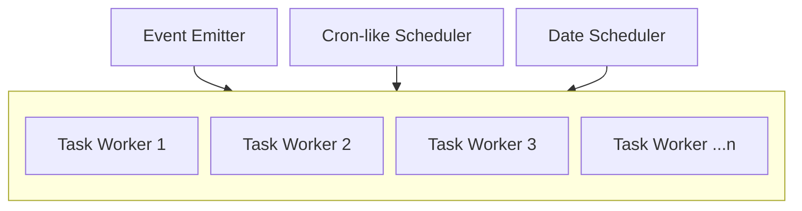
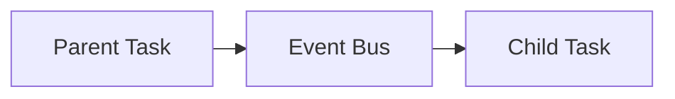

<br/>
<br/>
<div align="middle">
    <picture>
        <source media="(prefers-color-scheme: dark)"  width="400px" srcset="https://i.imgur.com/cDMRWJB.png">
        
    </picture>
</div>

#

<h4 align="center">
    <strong>@xlsft/worker</strong> – Lightweight, cron, date and event-based task framework with zero-boilerplate setup
</h4>
<br/>
<p align="right">
    <picture>
        <source media="(prefers-color-scheme: dark)" srcset="https://i.imgur.com/CEBivQF.png">
        
    </picture>
</p>

<h2><strong>🔗 Table of Contents</strong></h2>

* <a href="#start">Quick Start</a>
* <a href="#structure">Project Structure & Naming</a>
* <a href="#triggers">Task Triggers</a>
* <a href="#event">Task Event</a>
* <a href="#emit">Calling a Task from Another Task</a>
* <a href="#kill">Killing or Canceling Task</a>
* <a href="#options">Task Options</a>
* <a href="#status">Project Status</a>

---

<h2 id="start"><strong>⭐ Quick Start</strong></h2>

**@xlsft/worker** is a simple but powerful worker framework. Supported on `node`, `deno` and `bun`.
It automatically loads and schedules all `*.task.[ts,js,mts,mjs]` files from the `tasks` directory.  
Tasks can run on a cron schedule or be triggered by events.

Install `@xlsft/worker` package

```bash
pnpm add jsr:@xlsft/worker # or...
yarn add jsr:@xlsft/worker # or...
npx jsr add @xlsft/worker # or...
bunx jsr add @xlsft/worker
```

> [!WARNING]
> Do not use `deno add jsr:@xlsft/worker`! Due to JSR limitations with dynamic imports, it fails when registering tasks!

Create `tasks` folder and entry file

```ts
import { useTasks } from "@xlsft/worker";

useTasks()
```

You can pass custom logger or disable logging whatsoever

```ts
import { useTasks } from "@xlsft/worker";
const log = useLogger() // Some logger

useTasks({ log })
```

```ts
import { useTasks } from "@xlsft/worker";

useTasks({ log: false }) // Disables logging
```

Also you can change default `tasks` folder, be aware that it needs to be path from `process.cwd()`

```ts
import { useTasks } from "@xlsft/worker";

useTasks({ dir: 'src/tasks' })
```

Then run your script with following commands

```bash
deno run -A main.ts # or...
bun run main.ts # or...
node main.js
```

<h2 id="structure"><strong>📂 Project Structure & Naming</strong></h2>

All tasks must be placed in the `tasks` directory (or directory of your choice).
File names follow the pattern:

``` ts
<nn(optional)>.<name>.task.[ts,js,mts,mjs] // 01.some_job.task.ts || some_job.task.js || 03.job.task.mjs
```

Where:

- `nn(optional)` — numeric prefix for ordering in directory
- `name` — task name
- `.task.[ts,js,mts,mjs]` — required suffix

Example:

```
tasks/
│── 01.cron.task.ts 
│── 02.event.task.ts
│── other.task.ts
```

<h2 id="triggers"><strong>🕒 Task Triggers</strong></h2>

A task trigger can be:

1. **Cron based** — using <code><a href="https://docs.deno.com/api/deno/~/TaskCronScheduleSchema">TaskCronScheduleSchema</a></code>-like type or <code><a href="https://wikipedia.org/wiki/Cron">cron syntax</a></code>
2. **Event based** — for manual or cross-task triggering with <code><a href="https://nodejs.org/api/events.html#events">EventEmitter</a></code>
3. **Date based** - for triggering task only once at some date

Examples:

1. Cron based `cron syntax`:

```ts
import { defineTask } from "@xlsft/worker";

export default defineTask((event) => {
    console.log('Running every minute');
}, '* * * * *');
```

2. Cron based `TaskCronScheduleSchema`:

```ts
import { defineTask } from "@xlsft/worker";

export default defineTask((event) => {
    console.log('Running every 30 minutes');
}, { minute: { every: 30 } });
```

3. Event based:

```ts
import { defineTask } from "@xlsft/worker";

export default defineTask((event) => {
    console.log('Triggered by event.emit("event")');
}, 'event');
```

4. Event based from generated trigger (from task name):

```ts
// name.task.ts

import { defineTask } from "@xlsft/worker";

export default defineTask((event) => {
    console.log('Triggered by event.emit("name")');
});
```

5. Date based:

```ts
// name.task.ts

import { defineTask } from "@xlsft/worker";

export default defineTask((event) => {
    console.log('Triggered at Tue Jan 01 2030 00:00:00');
}, new Date(2030, 0, 1));
```


<h2 id="event"><strong>📣 Task Event</strong></h2>

For every task `event: TaskEvent` class is passed for logging or some other purposes

```ts
// event.task.ts

import { defineTask } from "@xlsft/worker"

export default defineTask((event) => {
    console.log(event);
    //  TaskEvent {
    //      worker: [Function: worker],
    //      created: 2025-08-14T16:34:31.990Z,
    //      state: { status: "running" },
    //      data: { name: "event", trigger: "event", cron: false },
    //      emit: [Function: emit]
    //  }
});
```
Ensure you **doesn\`t** modify event class, because `event` is _readonly_

```ts
import { defineTask } from "@xlsft/worker"

export default defineTask((event) => {
    console.log(event);
    event.state.status = 'canceled'; // TS error
}, { minute: { every: 1 }});
```

<h2 id="emit"><strong>📡 Calling a Task from Another Task</strong></h2>

You can call (trigger) another task by emitting an event:

```ts
// 01.parent.task.ts

import { defineTask } from "@xlsft/worker";

export default defineTask((event) => {
    console.log('Parent job running...');
    event.emit('children');
}, { minute: { every: 1 } });

// 02.children.task.ts

import { defineTask, events } from "tasks";

export default defineTask((event) => {
    console.log('Children job running');
}, 'children');
```



<h2 id="kill"><strong>🔪 Killing or Canceling Task</strong></h2>

You can kill or cancel task using `event.kill()` or `event.cancel()`

The difference between canceling and killing a job is that canceling stops only the current run and allows you to start a new one, whereas killing stops the job entirely and it cannot be restarted

```ts
// first_job.task.ts

import { defineTask } from "@xlsft/worker"

export default defineTask((event) => {
    console.log('Job running');
    event.cancel();
    console.log('Unreachable');
}, 'first_job');

// second_job.task.ts

import { defineTask } from "@xlsft/worker"

export default defineTask((event) => {
    console.log('Start first job');
    event.emit('first_job'); // Works!
}, { minute: { every: 1 }});
```

```ts
// first_job.task.ts

import { defineTask } from "@xlsft/worker"

export default defineTask((event) => {
    console.log('Job running');
    event.kill();
    console.log('Unreachable');
}, 'first_job');

// second_job.task.ts

import { defineTask } from "@xlsft/worker"

export default defineTask((event) => {
    console.log('Start first job');
    event.emit('first_job'); // Doesn`t work :(
}, { minute: { every: 1 }});
```

<h2 id="options"><strong>⚙️ Task Options</strong></h2>

Now you can set 3 different modifications to your worker

1. `retry` – number of additional attempts the worker will make if the task fails
2. `times` – number of times the task should run in a single execution
3. `delay` – time in milliseconds to wait between task executions or retries

```ts
export default defineTask((event) => {
    console.log('Task starts, but fails');
    throw new Error('Error');
}, 'event', { times: 2, delay: 2000, retry: 5 });
```
In this example:

- The task will run 2 times (times: 2), but, if it fails, job will retry with 2 times again
- It will wait 2 seconds between each run or retry (delay: 2000)
- If it fails, it will retry up to 5 times (retry: 5)

<h2 id="status"><strong>📌 Project Status</strong></h2>

**Testing in production** — API and internal structure are stable, but needs testing for edge-cases

<br/>

<div align="center">
  <a href="https://t.me/xlsoftware" target="_blank" rel="noreferrer">
    <picture>
        <source media="(prefers-color-scheme: dark)" width="200px" srcset="https://i.imgur.com/PO4nXai.png">
        
    </picture>
  </a>
</div>