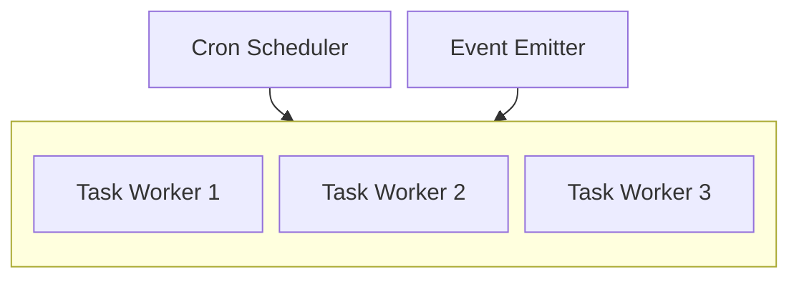
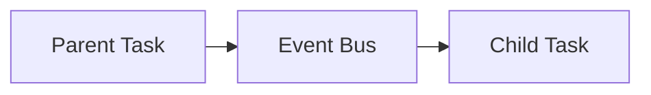

<br/>
<br/>
<div align="middle">
    <picture>
        <source media="(prefers-color-scheme: dark)"  width="400px" srcset="https://i.imgur.com/ESMaHhv.png">
        
    </picture>
</div>

#

<h4 align="center">
    <strong>@xlsft/worker</strong> – Lightweight, event and cron-based task runner for Deno with zero-boilerplate setup and persisted logs
</h4>
<br/>
<p align="right">
    <picture>
        <source media="(prefers-color-scheme: dark)" srcset="https://i.imgur.com/CEBivQF.png">
        
    </picture>
</p>

<h2><strong>🔗 Table of Contents</strong></h2>

* <a href="#before">Before you start</a>
* <a href="#start">Quick Start</a>
* <a href="#structure">Project Structure & Naming</a>
* <a href="#triggers">Task Triggers</a>
* <a href="#event">Task Event</a>
* <a href="#emit">Calling a Task from Another Task</a>
* <a href="#kill">Killing or Canceling Task</a>
* <a href="#options">Task Options</a>
* <a href="#logging">Logging</a>
* <a href="#status">Project Status</a>

---

<h2 id="before"><strong>🚀 Before you start</strong></h2>

This template depends on MongoDB, so, install it and make sure it`s accessible before go any further!

<h2 id="start"><strong>⭐ Quick Start</strong></h2>

**@xlsft/worker** is a simple but powerful worker engine for Deno.  
It automatically loads and schedules all `*.task.ts` files from the `tasks` directory.  
Tasks can run on a cron schedule or be triggered by events.

**Run locally**:
```bash
deno task dev
```
**Run in Docker**:
```bash
docker compose up -d
```
**Environment (optional)**:
```
MONGO_URI = "127.0.0.1:27017" # Default value
```

<h2 id="structure"><strong>📂 Project Structure & Naming</strong></h2>

All tasks must be placed in the `tasks` directory.
File names follow the pattern:

``` ts
<nn(optional)>.<name>.task.ts // 01.some_job.task.ts || some_job.task.ts
```

Where:

- `nn(optional)` — numeric prefix for ordering in directory
- `name` — task name
- `.task.ts` — required suffix

Example:

```
tasks/
│── 01.cron.task.ts 
│── 02.event.task.ts
│── other.task.ts
```

<h2 id="triggers"><strong>🕒 Task Triggers</strong></h2>

A task trigger can be:

1. **Cron based** — using <code><a href="https://docs.deno.com/api/deno/~/Deno.CronSchedule">Deno.CronSchedule</a></code> type or <code><a href="https://wikipedia.org/wiki/Cron">cron syntax</a></code>
2. **Event based** — for manual or cross-task triggering with <code><a href="https://nodejs.org/api/events.html#events">EventEmitter</a></code>

Examples:

1. Cron based `cron syntax`:

```ts
import { defineTask } from "tasks";

export default defineTask(async () => {
    console.log('Running every minute');
}, '* * * * *');
```

2. Cron based `Deno.CronSchedule`:

```ts
import { defineTask } from "tasks";

export default defineTask(async () => {
    console.log('Running every 30 minutes');
}, { minute: { every: 30 } });
```

3. Event based:

```ts
import { defineTask } from "tasks";

export default defineTask(async () => {
    console.log('Triggered by event');
}, 'event_name');
```


<h2 id="event"><strong>📣 Task Event</strong></h2>

For every task `event: ReadonlyTaskEvent` object is passed for logging or some other purposes

```ts
import { defineTask } from "tasks"

export default defineTask((event) => {
    console.log(event)
    // {
    //   state: { status: "running", attempt: 1 },
    //   data: {
    //     name: "event",
    //     trigger: { minute: { every: 1 } },
    //     uuid: "88ce56e2-2ae8-4e1c-b502-cab7132b03fc",
    //     cron: true
    //   },
    //   task: [Function (anonymous)],
    //   worker: [Function: worker],
    //   options: { retry: 5, delay: 2000 },
    //   kill: [Function: kill],
    //   cancel: [Function: cancel],
    //   emit: [Function: emit]
    // }
}, { minute: { every: 1 }}, { retry: 5, delay: 2000 })
```
Ensure you **doesn\`t** modify event object, because `event` is _readonly_

```ts
import { defineTask } from "tasks"

export default defineTask((event) => {
    console.log(event)
    event.state.status = 'canceled' // TS error
}, { minute: { every: 1 }})
```

<h2 id="emit"><strong>📡 Calling a Task from Another Task</strong></h2>

You can call (trigger) another task by emitting an event:

```ts
// 01.first_job.task.ts

import { defineTask } from "tasks";

export default defineTask(async (event) => {
    console.log('First job running...');
    event.emit('event_name'); // triggers any task listening for 'event_name'
}, { minute: { every: 1 } });
```

```ts
// 02.post_job.task.ts

import { defineTask, events } from "tasks";

export default defineTask(async () => {
    console.log('Post-sync job running');
}, 'event_name');
```



<h2 id="kill"><strong>🔪 Killing or Canceling Task</strong></h2>

You can kill or cancel task using `event.kill()` or `event.cancel()`

The difference between canceling and killing a job is that canceling stops only the current run and allows you to start a new one, whereas killing stops the job entirely and it cannot be restarted

```ts
// first_job.task.ts

import { defineTask } from "tasks"

export default defineTask((event) => {
    console.log('Job running')
    event.cancel()
    console.log('unreachable')
}, 'first_job')

// second_job.task.ts

import { defineTask } from "tasks"

export default defineTask((event) => {
    console.log('start first job')
    event.emit('first_job') // Works!
}, { minute: { every: 1 }})
```

```ts
// first_job.task.ts

import { defineTask } from "tasks"

export default defineTask((event) => {
    console.log('Job running')
    event.kill()
    console.log('unreachable')
}, 'first_job')

// second_job.task.ts

import { defineTask } from "tasks"

export default defineTask((event) => {
    console.log('start first job')
    event.emit('first_job') // Doesn`t work :(
}, { minute: { every: 1 }})
```

<h2 id="options"><strong>⚙️ Task Options</strong></h2>

Now you can set 3 different modifications to your worker

1. `retry` – number of additional attempts the worker will make if the task fails
2. `times` – number of times the task should run in a single execution
3. `delay` – time in milliseconds to wait between task executions or retries

```ts
export default defineTask(async () => {
    console.log('Users synced and waiting for next task, but it fails')
    throw new Error('Error')
}, 'event', { times: 2, delay: 2000, retry: 5 })
```
In this example:

- The task will run 2 times (times: 2), but, if it fails, job will retry with 2 times again
- It will wait 2 seconds between each run or retry (delay: 2000)
- If it fails, it will retry up to 5 times (retry: 5)

<h2 id="logging"><strong>💾 Logging</strong></h2>

This package uses a custom logger that persists logs in MongoDB, storing them in `worker.logs` in the following format:

```json
{
    "deleted_at": null,
    "type": "info",
    "message": "[\"🎯 Defining new task\",{\"state\":{\"status\":\"pending\"},\"name\":\"event\",\"trigger\":\"event\",\"uuid\":\"447600b7-a327-4a9c-b034-9e0b4d6a2247\",\"cron\":false}]",
    "session": "566d42f9-e9ed-4f2f-b804-1532ba9c30ea",
    "created_at": {
        "$date": "2025-08-14T11:13:09.534Z"
    },
    "updated_at": {
        "$date": "2025-08-14T11:13:09.534Z"
    },
    "__v": 0
}
```

You can dump these logs, for example, to display them on a custom frontend, integrate with an external monitoring tool, or share for troubleshooting.

<h2 id="status"><strong>📌 Project Status</strong></h2>

**Testing in production** — API and internal structure are stable, but needs testing for edge-cases

<br/>

<div align="center">
  <a href="https://t.me/xlsoftware" target="_blank" rel="noreferrer">
    <picture>
        <source media="(prefers-color-scheme: dark)" width="200px" srcset="https://i.imgur.com/PO4nXai.png">
        
    </picture>
  </a>
</div>