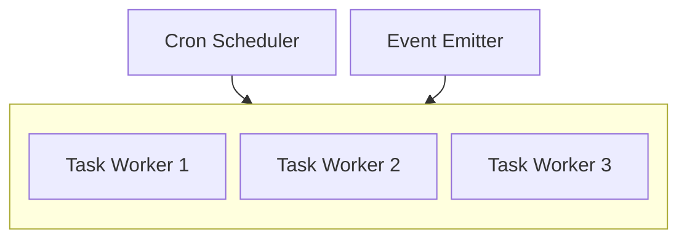
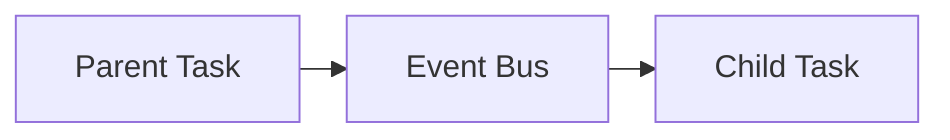

<br/>
<br/>
<div align="middle">
    <picture>
        <source media="(prefers-color-scheme: dark)"  width="400px" srcset="https://i.imgur.com/ESMaHhv.png">
        
    </picture>
</div>

#

<h4 align="center">
    <strong>@xlsft/worker</strong> – Lightweight, event and cron-based task runner for Deno with zero-boilerplate setup and state management via MongoDB.
</h4>
<br/>
<p align="right">
    <picture>
        <source media="(prefers-color-scheme: dark)" srcset="https://i.imgur.com/CEBivQF.png">
        
    </picture>
</p>

<h2><strong>🔗 Table of Contents</strong></h2>

* <a href="#start">Quick Start</a>
* <a href="#structure">Project Structure & Naming</a>
* <a href="#triggers">Task Triggers</a>
* <a href="#emit">Calling a Task from Another Task</a>
* <a href="#status">Project Status</a>

---

<h2 id="start"><strong>💾 Quick Start</strong></h2>

**@xlsft/worker** is a simple but powerful worker engine for Deno.  
It automatically loads and schedules all `*.task.ts` files from the `tasks` directory.  
Tasks can run on a cron schedule or be triggered by events.

**Run locally**:
```bash
deno task dev
```
**Run in Docker**:
```bash
docker compose up -d
```
**Environment (optional)**:
```
MONGO_URI = "127.0.0.1:27017" # Default value
```

<h2 id="structure"><strong>📂 Project Structure & Naming</strong></h2>

All tasks must be placed in the `tasks` directory.
File names follow the pattern:

``` ts
<nn(optional)>.<name>.task.ts // 01.some_job.task.ts || some_job.task.ts
```

Where:

- `nn(optional)` — numeric prefix for ordering in directory
- `name` — task name
- `.task.ts` — required suffix

Example:

```
tasks/
│── 01.cron.task.ts 
│── 02.event.task.ts
│── other.task.ts
```

<h2 id="triggers"><strong>🕒 Task Triggers</strong></h2>

A task trigger can be:

1. **Cron based** — using <code><a href="https://docs.deno.com/api/deno/~/Deno.CronSchedule">Deno.CronSchedule</a></code> type or <code><a href="https://wikipedia.org/wiki/Cron">cron syntax</a></code>
2. **Event based** — for manual or cross-task triggering with <code><a href="https://nodejs.org/api/events.html#events">EventEmitter</a></code>

Examples:

1. Cron based `cron syntax`:

```ts
import { defineTask } from "tasks";

export default defineTask(async () => {
    console.log('Running every minute');
}, '* * * * *');
```

2. Cron based `Deno.CronSchedule`:

```ts
import { defineTask } from "tasks";

export default defineTask(async () => {
    console.log('Running every 30 minutes');
}, { minute: { every: 30 } });
```

3. Event based:

```ts
import { defineTask } from "tasks";

export default defineTask(async () => {
    console.log('Triggered by event');
}, 'event_name');
```




<h2 id="emit"><strong>📡 Calling a Task from Another Task</strong></h2>

You can call (trigger) another task by emitting an event:

```ts
// 01.first_job.task.ts

import { defineTask, events } from "tasks";

export default defineTask(async () => {
    console.log('First job running...');
    await new Promise(_ => setTimeout(_, 5000)); // wait 5s
    events.emit('event_name'); // triggers any task listening for 'event_name'
}, { minute: { every: 1 } });
```

```ts
// 02.post_job.task.ts

import { defineTask, events } from "tasks";

export default defineTask(async () => {
    console.log('Post-sync job running');
}, 'event_name');
```




<h2 id="status"><strong>📌 Project Status</strong></h2>

**Active development** — API and internal structure are stable,
but features like retry policies are in planning.

<br/>

<div align="center">
  <a href="https://t.me/xlsoftware" target="_blank" rel="noreferrer">
    <picture>
        <source media="(prefers-color-scheme: dark)" width="200px" srcset="https://i.imgur.com/PO4nXai.png">
        
    </picture>
  </a>
</div>